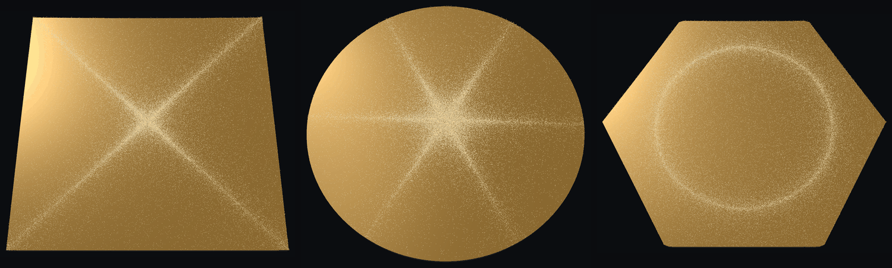
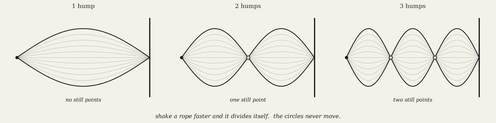
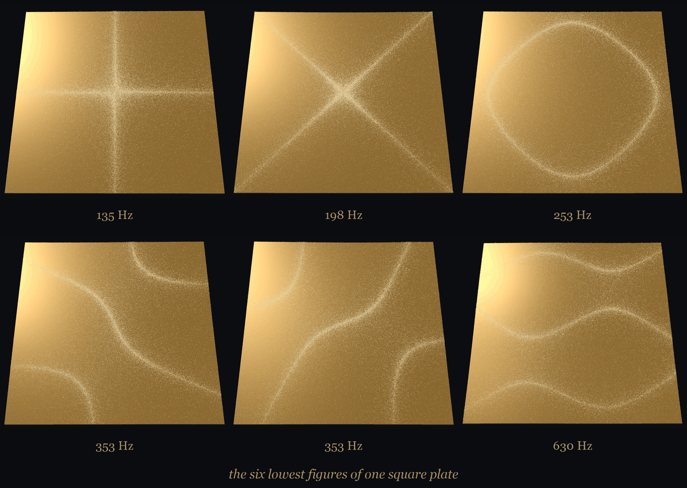
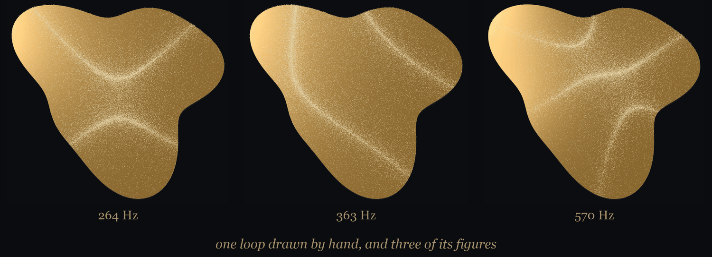

# sonoform

**Every shape has a sound. Sprinkle sand on it and the sand will show you.**



```bash
git clone https://github.com/samehaisaa/sonoform
cd sonoform
pip install -e .
sonoform play
```

Pick a plate. Press bow. Watch the sand find the pattern.

## Why the sand does that

When a plate rings, some of it swings and some of it holds perfectly still.
Sand slides off whatever is moving and piles up on whatever is not.

A shaken rope does the same thing with one dimension fewer. Shake it faster
and it divides itself, and the circles below never move.



On a sheet those still spots are lines instead of points. That is the figure.

## Things to try

- **Move the bow.** Click anywhere. Put it on a line that is already still and
  the plate refuses to sing.
- **Turn it.** Drag to orbit, scroll to zoom.

**Change the note.** Six to a plate, and every one of them draws something else.



**Draw your own plate.** Any closed loop. It gets solved the same way.



Ernst Chladni did this in 1787 with a brass plate, a violin bow and a handful
of sand. These ones are computed from the metal, and they come out the same.

<details>
<summary><b>The math part</b></summary>

A thin plate resists bending, which is fourth order, rather than the
second-order stretching of a drum skin. Deflection $w$ at angular frequency
$\omega$ obeys

$$D \nabla^4 w = \rho h \omega^2 w$$

with $D = \frac{Eh^3}{12(1-\nu^2)}$ the bending stiffness and the edge left
completely free. Solved with Argyris triangles, which are quintic and carry
continuous first derivatives, as a fourth-order problem requires.

Checked against Leissa's free square plate, in the dimensionless form the
tables use:

| | computed | reference |
| --- | --- | --- |
| 1st | 13.09 | 13.47 |
| 2nd | 19.14 | 19.60 |
| 3rd | 24.44 | 24.27 |
| 4th, 5th | 34.11, 34.11 | 34.80, 34.80 |

The gap is Poisson's ratio, quoted at 0.30 against brass at 0.34, and not
discretisation: run the solver at 0.30 and every mode lands within 0.02% of the
reference. The reference itself is not taken on trust. `tests/test_plate.py`
rebuilds it with Rayleigh-Ritz on a Legendre basis, which shares no code with
the Argyris path, and a table of constants checked only against this solver
would not be a benchmark at all.

The three rigid-body motions come out at $4 \times 10^{-13}$ of the first
flexible eigenvalue, which is the check that the free edge is really free.

**The sand.** Grains are not pushed toward the nodes, and there is no average
force at all. Grabec (*Phys. Lett. A* **381**, 59, 2017) suggested it and
Abramian, Protière, Lazarus and Devauchelle (*Phys. Rev. Research* **7**,
L032001, 2025) measured it: a grain where the plate moves gets thrown and lands
somewhere random, a grain where it is quiet stays put. That is a random walk
whose diffusivity follows the local amplitude,

$$\mathrm{d}x = \sqrt{2 D(x)\,\mathrm{d}t}\,\xi, \qquad D(x) = D_0 + |A(x)|$$

with no drift, whose steady state is $\rho \propto 1/D$.

$D$ must be sampled where the grain starts. Adding the $\nabla D$ correction
that much of the stochastic literature recommends flips the convention and the
steady state goes uniform, so the plate comes out blank with no crash and no
warning. `tests/test_sand_transport.py` pins it.

**Also here.** The earlier drum-skin solver, and inverse design on top of it:
name a chord and it fits a shape whose partials match. It knows which chords
are impossible, since Ashbaugh and Benguria proved in 1992 that
$\lambda_2/\lambda_1 \le (j_{1,1}/j_{0,1})^2$, so no drum's second partial can
exceed 1.5934 times its first and none of them play an octave.

```bash
sonoform tune major
sonoform chords
```

</details>

<details>
<summary><b>Credit where it is due</b></summary>

**The phenomenon.** E. F. F. Chladni, *Entdeckungen über die Theorie des
Klanges*, Weidmanns Erben und Reich, Leipzig (1787). M. Faraday, *On a
peculiar class of acoustical figures, and on certain forms assumed by groups
of particles upon vibrating elastic surfaces*, Phil. Trans. R. Soc. London
**121**, 299 (1831).

**Why the sand moves.** I. Grabec, *Vibration driven random walk in a Chladni
experiment*, Phys. Lett. A **381**, 59 (2017), for the idea that the grains
are random walkers. A. Abramian, S. Protière, A. Lazarus and O. Devauchelle,
*Chladni patterns explained by the space-dependent diffusion of bouncing
grains*, Phys. Rev. Research **7**, L032001 (2025), for measuring it. The
$\rho \propto 1/D$ steady state is the zero-flux state of the transport
relation in M. Büttiker, *Transport as a consequence of state-dependent
diffusion*, Z. Phys. B **68**, 161 (1987), and R. Landauer, *Motion out of
noisy states*, J. Stat. Phys. **53**, 233 (1988). The convention trap is
surveyed in G. Volpe and J. Wehr, *Effective drifts in dynamical systems with
multiplicative noise*, Rep. Prog. Phys. **79**, 053901 (2016).

**The plate.** A. W. Leissa, *Vibration of Plates*, NASA SP-160, US
Government Printing Office (1969), for the benchmark. J. H. Argyris, I. Fried
and D. W. Scharpf, *The TUBA family of plate elements for the matrix
displacement method*, Aeronautical Journal **72**, 701 (1968), for the
element.

**The bound on chords.** M. S. Ashbaugh and R. D. Benguria, *A sharp bound for
the ratio of the first two eigenvalues of Dirichlet Laplacians and
extensions*, Annals of Mathematics **135**, 601 (1992), settling the
conjecture of Payne, Pólya and Weinberger.

**The tool.** T. Gustafsson and G. D. McBain, *scikit-fem: a Python package
for finite element assembly*, Journal of Open Source Software **5**, 2369
(2020), [doi:10.21105/joss.02369](https://doi.org/10.21105/joss.02369).

</details>

## Licence

MIT
