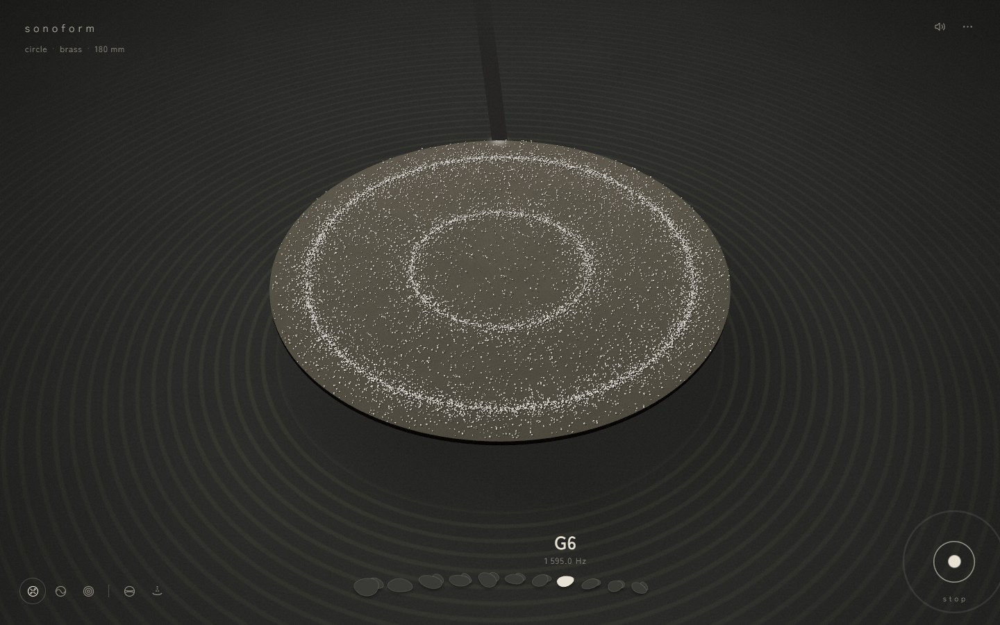
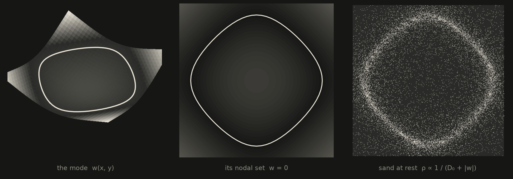
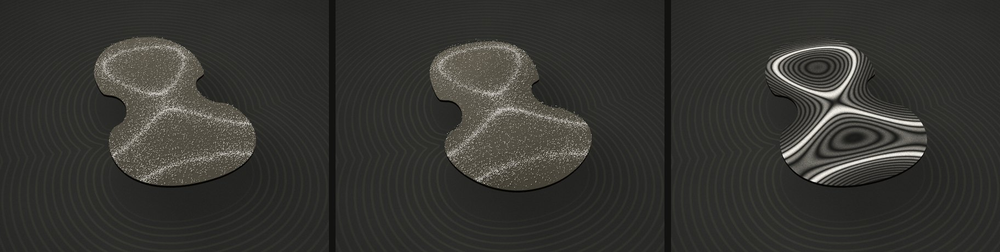
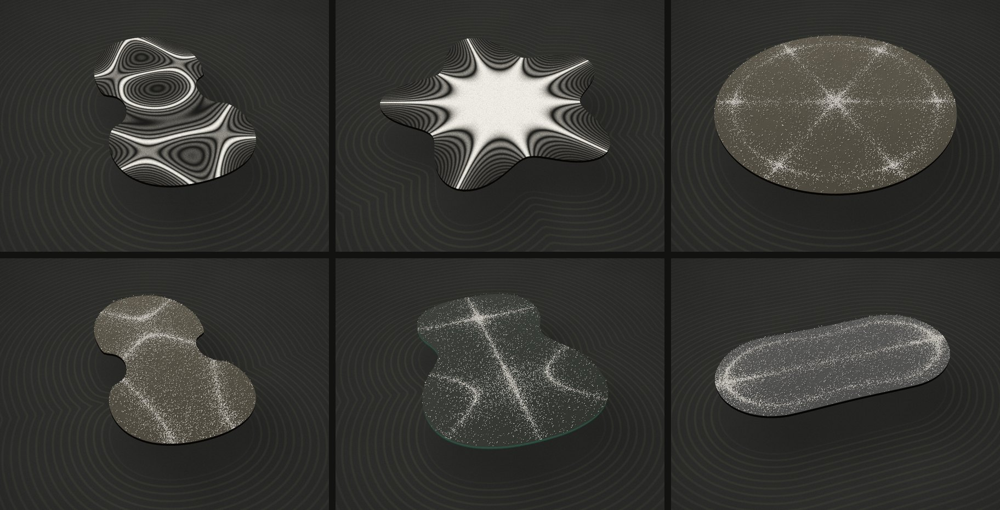
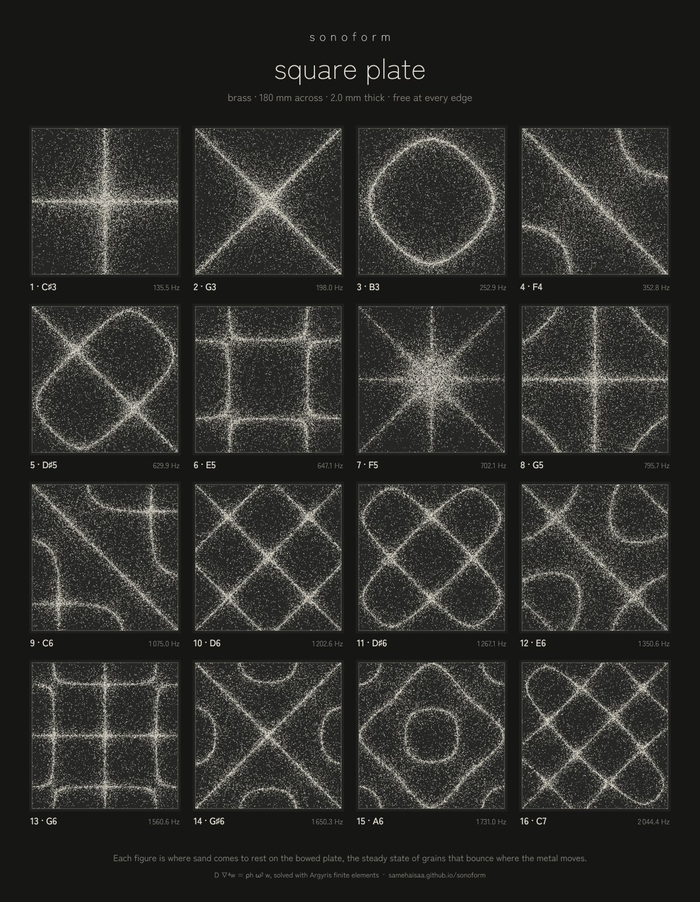

<div align="center">

# sonoform

$$D\,\nabla^4 w = \rho h\,\omega^2 w$$

Each solution of this equation on a plate free at every edge is a mode $w(x, y)$ with its own frequency $\omega$.<br>
The lines the sand settles on are its nodal set, the curves where $w = 0$ and the plate does not move.

**[Open the plate →](https://samehaisaa.github.io/sonoform/)**

[](https://github.com/samehaisaa/sonoform/actions/workflows/ci.yml)
[](https://samehaisaa.github.io/sonoform/)
[](LICENSE)



</div>

Chladni's experiment from 1787, computed. Bow the plate and the sand walks onto
the nodal lines of that note. Tap it and every note rings at once, so nothing
settles. Nine plates, five metals, up to twenty notes each.

## Why the sand goes there



Where the plate moves, grains are thrown and land at random. Where $w = 0$ they
stay. That random walk settles with density $\rho \propto 1/(D_0 + |w|)$, which
is the nodal set. The figure is drawn from the solver by `tools/figure_nodal.py`.

## Three ways of looking



Sand, as Chladni saw it. A stroboscope, which slows the motion to one swing
every two seconds. A time-averaged hologram, which glows as $J_0^2(4\pi A/\lambda)$,
with a dark fringe at every sixth of a micron of swing.



The atlas prints every figure of a plate at once and downloads as a poster.

<p align="center"></p>

## Run it

```bash
pip install -e .
sonoform play
```

or `docker run --rm -p 8731:8731 ghcr.io/samehaisaa/sonoform`.

Keys: <kbd>Space</kbd> bow, <kbd>←</kbd> <kbd>→</kbd> note, <kbd>T</kbd> tap,
<kbd>V</kbd> view, <kbd>N</kbd> nodal lines, <kbd>S</kbd> plate and metal,
<kbd>A</kbd> atlas, <kbd>I</kbd> the physics.

<details>
<summary><b>How it works</b></summary>

**The plate.** $D = Eh^3/12(1-\nu^2)$ is the bending stiffness. Each outline is
solved once with Argyris triangles, quintic elements with continuous slopes, for
its twenty lowest flexible modes. The page receives each mode as the exact
quintic on every triangle and evaluates it per pixel for the nodal lines and
fringes. Metal and size only rescale the frequency,
$f = \frac{\Omega}{2\pi L^2}\sqrt{D/\rho h}$. Poisson's ratio stays inside the
equation, so each metal's $\nu$ is solved on its own.

**The sand.** No force pushes grains toward the lines. The walk
$\mathrm{d}x = \sqrt{2D(x)\,\mathrm{d}t}\,\xi$ with $D \propto D_0 + |A|$ and no
drift has the steady state above, as Abramian et al. measured in 2025.

**The sound.** Each mode radiates through the Rayleigh integral, computed
separately for each ear, and decays at $\pi\eta f$ plus its own radiation loss.
A bowed note is a pure tone; a tap is every mode at once.

**Checks.** The free square matches Leissa's table to five figures and the free
disc matches the roots of Kirchhoff's frequency equation. The rigid-body modes
come out near $10^{-12}$ of the first flexible one. `pytest` also runs the
page's JavaScript against the Python package on the same plates.

</details>

<details>
<summary><b>References</b></summary>

- E. F. F. Chladni, *Entdeckungen über die Theorie des Klanges*, Leipzig (1787).
- G. Kirchhoff, J. reine angew. Math. **40**, 51 (1850).
- A. W. Leissa, *Vibration of Plates*, NASA SP-160 (1969).
- J. H. Argyris, I. Fried and D. W. Scharpf, Aeronaut. J. **72**, 701 (1968).
- I. Grabec, Phys. Lett. A **381**, 59 (2017).
- A. Abramian, S. Protière, A. Lazarus and O. Devauchelle, Phys. Rev. Research **7**, L032001 (2025).
- R. L. Powell and K. A. Stetson, J. Opt. Soc. Am. **55**, 1593 (1965).
- Lord Rayleigh, *The Theory of Sound* (1877).
- L. Cremer, M. Heckl and B. A. T. Petersson, *Structure-Borne Sound*, Springer (2005).
- L. A. Bunimovich, Commun. Math. Phys. **65**, 295 (1979).
- T. Gustafsson and G. D. McBain, J. Open Source Softw. **5**, 2369 (2020).

</details>

## Licence

MIT
